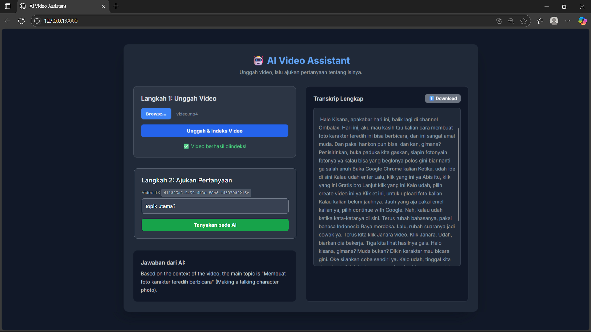

# 🤖 Asisten Video AI (Versi RAG Lokal)

Proyek ini adalah asisten AI canggih yang berjalan sepenuhnya di komputer Anda (self-hosted). Aplikasi ini dapat mengindeks konten video dan menjawab pertanyaan dalam bahasa alami tentang isinya. Proyek ini dibangun menggunakan arsitektur **Retrieval-Augmented Generation (RAG)**, dengan memanfaatkan model open-source canggih dari Hugging Face, termasuk **Large Language Model (LLM) Llama 3**, untuk menyediakan pengalaman tanya jawab yang sepenuhnya pribadi, gratis, dan dipercepat oleh GPU.

Aplikasi ini memiliki antarmuka web modern yang dibangun dengan **FastAPI** dan **Tailwind CSS**, memungkinkan pengguna untuk dengan mudah mengunggah video, melihat transkrip lengkap, dan berinteraksi dengan AI.

---

## ✨ Fitur

* **Indeksasi Video**: Memproses file video `.mp4` apa pun untuk membuat indeks semantik yang dapat dicari dari konten yang diucapkan.
* **Tanya Jawab Cerdas**: Mengajukan pertanyaan dalam bahasa biasa tentang konten video dan menerima jawaban yang akurat dan sadar konteks yang dihasilkan oleh Large Language Model.
* **UI Interaktif**: Antarmuka web bergaya dasbor yang bersih untuk mengunggah video, melihat transkrip, dan berinteraksi dengan AI.
* **Tampilan & Unduh Transkrip Lengkap**: Melihat transkrip lengkap langsung di UI atau mengunduhnya sebagai file `.txt`.
* **Akselerasi GPU**: Secara otomatis memanfaatkan GPU NVIDIA melalui **PyTorch** dan **CUDA** untuk transkripsi dan pembuatan jawaban yang jauh lebih cepat.
* **100% Lokal & Pribadi**: Berjalan sepenuhnya di mesin lokal Anda. Video dan data Anda tidak pernah dikirim ke layanan pihak ketiga, memastikan privasi lengkap dan tanpa biaya API.

---

## 📸 Screenshot

Berikut adalah pratinjau antarmuka pengguna aplikasi:



---

## 🛠️ Tumpukan Teknologi

Proyek ini menggabungkan beberapa teknologi canggih dari ekosistem AI Python.

* **Backend**: FastAPI, Uvicorn
* **Frontend**: HTML, Tailwind CSS, JavaScript
* **Model AI (Hugging Face)**:
    * **Transkripsi**: `openai/whisper-base` untuk mengubah ucapan menjadi teks.
    * **Embeddings**: `sentence-transformers/all-MiniLM-L6-v2` untuk membuat representasi vektor semantik dari teks.
    * **AI Generatif (LLM)**: `meta-llama/Meta-Llama-3-8B-Instruct` untuk memahami konteks dan menghasilkan jawaban.
* **Library Inti AI**: `transformers`, `torch`, `sentence-transformers`, `accelerate`
* **Database Vektor**: `faiss-cpu` / `faiss-gpu` untuk pencarian kemiripan yang efisien.
* **Pemrosesan Video/Audio**: `ffmpeg-python`

---

## 🚀 Pengaturan dan Instalasi

Ikuti langkah-langkah ini untuk menjalankan proyek di mesin lokal Anda.

### Prasyarat

* Python 3.9+
* GPU NVIDIA dengan CUDA terinstal sangat direkomendasikan untuk performa yang baik.
* FFMPEG terinstal dan ditambahkan ke `PATH` environment variable sistem Anda.

### Langkah-langkah Instalasi

1.  Clone repositori ini:

    ```bash
    git clone [https://github.com/NAMA_ANDA/asisten-video-ai.git](https://github.com/NAMA_ANDA/asisten-video-ai.git)
    cd asisten-video-ai
    ```

2.  Buat dan aktifkan lingkungan virtual:

    ```bash
    # Membuat environment
    python -m venv venv
    
    # Aktivasi di Windows
    venv\Scripts\activate
    
    # Aktivasi di macOS/Linux
    source venv/bin/activate
    ```

3.  Instal semua library yang dibutuhkan:
    Pertama, instal PyTorch dengan dukungan CUDA. Kunjungi situs web PyTorch untuk mendapatkan perintah yang benar untuk versi CUDA Anda. Contoh:

    ```bash
    pip install torch torchvision torchaudio --index-url [https://download.pytorch.org/whl/cu121](https://download.pytorch.org/whl/cu121)
    ```

    Kemudian, instal paket lainnya dari file `requirements.txt`:

    ```bash
    pip install -r requirements.txt
    ```

4.  Siapkan environment variable Anda:
    Buat file di direktori utama bernama `.env`.
    Tambahkan Token Akses Hugging Face Anda ke dalamnya. Anda memerlukan ini untuk mengunduh model Llama 3.

    ```
    HUGGING_FACE_TOKEN="hf_..."
    ```

5.  Login ke Hugging Face:
    Jalankan perintah ini di terminal Anda dan tempelkan token Anda saat diminta.

    ```bash
    huggingface-cli login
    ```

---

## ⚙️ Cara Menggunakan

1.  **Jalankan Server**
    Mulai server FastAPI dari terminal Anda (pastikan lingkungan virtual Anda aktif):

    ```bash
    uvicorn main:app --reload
    ```

2.  **Buka Aplikasi**
    Buka browser web Anda dan kunjungi `http://127.0.0.1:8000`.

3.  **Indeks sebuah Video**
    * Di UI web, klik "Choose File" dan pilih video `.mp4`.
    * Klik tombol "Unggah & Indeks Video".
    * Tunggu proses pengindeksan selesai. Ini bisa memakan waktu lama tergantung pada panjang video dan perangkat keras Anda. Transkrip lengkap akan muncul di panel kanan setelah selesai.

4.  **Ajukan Pertanyaan**
    * Setelah pengindeksan selesai, kotak input pertanyaan akan muncul.
    * Ketik pertanyaan Anda tentang konten video dan klik "Tanyakan pada AI".
    * Jawaban dari AI akan muncul di bawah kotak input.
  


# 🤖 AI Video Assistant (Local RAG Version)

This project is an advanced AI assistant that runs entirely on your computer (self-hosted). The application can index video content and answer natural language questions about its contents. It is built using a **Retrieval-Augmented Generation (RAG)** architecture, leveraging state-of-the-art open-source models from Hugging Face, including the **Llama 3 Large Language Model (LLM)**, to provide a completely private, free, and GPU-accelerated Q&A experience.

The application features a modern web interface built with **FastAPI** and **Tailwind CSS**, allowing users to easily upload videos, view the full transcript, and interact with the AI.

---

## ✨ Features

* **Video Indexing**: Processes any `.mp4` video file to create a searchable semantic index of its spoken content.
* **Intelligent Q&A**: Ask questions in plain language about the video content and receive accurate, context-aware answers generated by a Large Language Model.
* **Interactive UI**: A clean, dashboard-style web interface for uploading videos, viewing transcripts, and interacting with the AI.
* **Full Transcript View & Download**: View the complete transcript directly in the UI or download it as a `.txt` file.
* **GPU Acceleration**: Automatically leverages an NVIDIA GPU via **PyTorch** and **CUDA** for significantly faster transcription and answer generation.
* **100% Local & Private**: Runs entirely on your local machine. Your videos and data are never sent to a third-party service, ensuring complete privacy and no API costs.

---

## 📸 Screenshots

Here is a preview of the application's user interface:


---

## 🛠️ Tech Stack

This project combines several advanced technologies from the Python AI ecosystem.

* **Backend**: FastAPI, Uvicorn
* **Frontend**: HTML, Tailwind CSS, JavaScript
* **AI Models (Hugging Face)**:
    * **Transcription**: `openai/whisper-base` for converting speech to text.
    * **Embeddings**: `sentence-transformers/all-MiniLM-L6-v2` for creating semantic vector representations of text.
    * **Generative AI (LLM)**: `meta-llama/Meta-Llama-3-8B-Instruct` for understanding context and generating answers.
* **Core AI Libraries**: `transformers`, `torch`, `sentence-transformers`, `accelerate`
* **Vector Database**: `faiss-cpu` / `faiss-gpu` for efficient similarity search.
* **Video/Audio Processing**: `ffmpeg-python`

---

## 🚀 Setup and Installation

Follow these steps to get the project running on your local machine.

### Prerequisites

* Python 3.9+
* An NVIDIA GPU with CUDA installed is highly recommended for good performance.
* FFMPEG is installed and added to your system's `PATH` environment variable.

### Installation Steps

1.  Clone this repository:

    ```bash
    git clone [https://github.com/NAMA_ANDA/asisten-video-ai.git](https://github.com/NAMA_ANDA/asisten-video-ai.git)
    cd asisten-video-ai
    ```

2.  Create and activate a virtual environment:

    ```bash
    # Create the environment
    python -m venv venv
    
    # Activation on Windows
    venv\Scripts\activate
    
    # Activation on macOS/Linux
    source venv/bin/activate
    ```

3.  Install all required libraries:
    First, install PyTorch with CUDA support. Visit the PyTorch website to get the correct command for your CUDA version. Example:

    ```bash
    pip install torch torchvision torchaudio --index-url [https://download.pytorch.org/whl/cu121](https://download.pytorch.org/whl/cu121)
    ```

    Then, install the rest of the packages from the `requirements.txt` file:

    ```bash
    pip install -r requirements.txt
    ```

4.  Set up your environment variables:
    Create a file in the main directory named `.env`.
    Add your Hugging Face Access Token to it. You will need this to download the Llama 3 model.

    ```
    HUGGING_FACE_TOKEN="hf_..."
    ```

5.  Log in to Hugging Face:
    Run this command in your terminal and paste your token when prompted.

    ```bash
    huggingface-cli login
    ```

---

## ⚙️ How to Use

1.  **Run the Server**
    Start the FastAPI server from your terminal (make sure your virtual environment is active):

    ```bash
    uvicorn main:app --reload
    ```

2.  **Open the Application**
    Open your web browser and navigate to `http://127.0.0.1:8000`.

3.  **Index a Video**
    * In the web UI, click "Choose File" and select an `.mp4` video.
    * Click the "Upload & Index Video" button.
    * Wait for the indexing process to complete. This can take a while depending on the video length and your hardware. The full transcript will appear in the right panel when done.

4.  **Ask a Question**
    * Once indexing is complete, a question input box will appear.
    * Type your question about the video content and click "Ask the AI".
    * The answer from the AI will appear below the input box.
